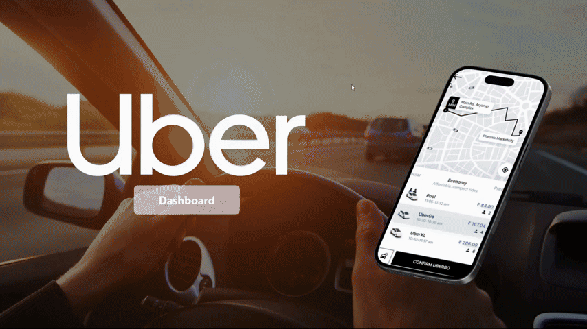
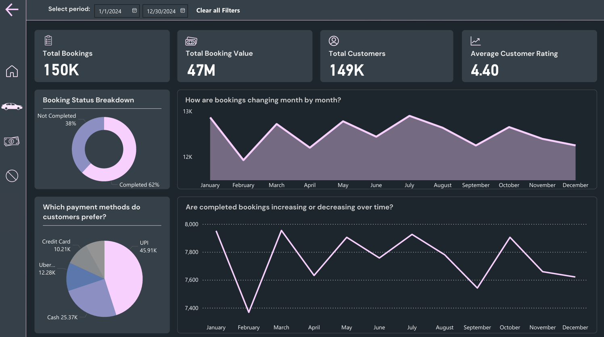
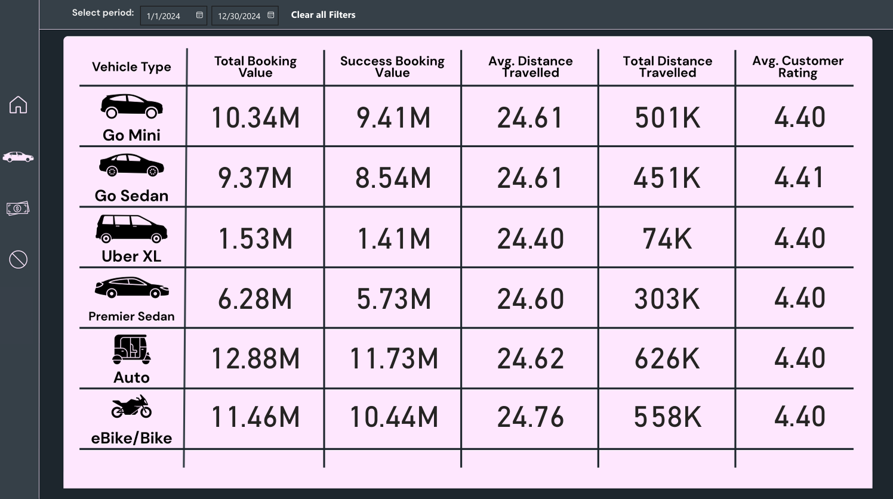
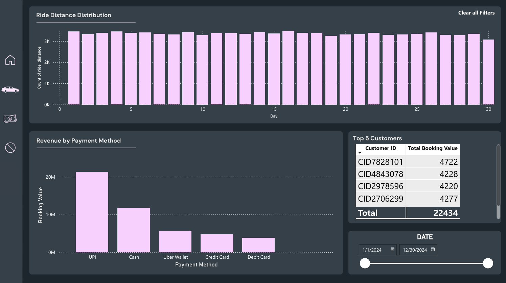
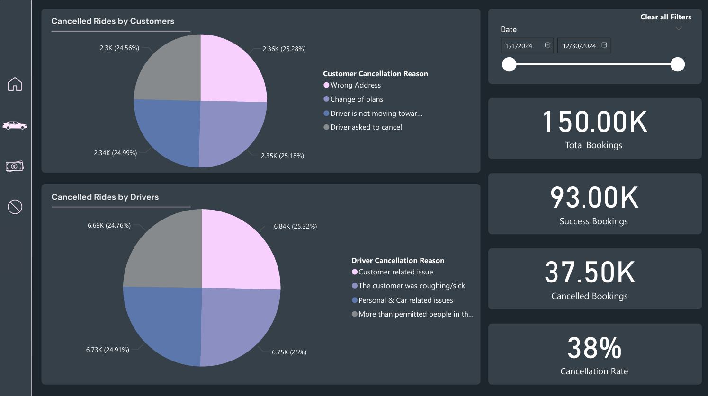

# Uber Ride Analytics Dashboard

## 📌 Introduction

Step into the world of **ride-hailing analytics**! This project uses the **Uber Ride Analytics Dataset (2024)** to explore booking patterns, cancellations, payment behavior, and ride performance.

With **SQL for data cleaning** and **Power BI for visualization**, I designed an interactive dashboard that helps uncover key insights into ride trends, customer behavior, and business challenges.

---

## 📖 Background

The project was motivated by simulating a **real-world Uber business scenario**:

* How do ride bookings trend across the year?
* What factors affect cancellation rates?
* Which payment methods are most popular?
* How do customer and driver behaviors impact overall performance?

The dataset consists of **150K+ bookings** with details about rides, distances, cancellations, customers, drivers, and payments.

### Key questions I wanted to answer:

1. What are the **monthly booking and revenue trends**?
2. What is the **cancellation rate**, and what are the top reasons (customer vs driver)?
3. Which **payment methods** dominate transactions?
4. What is the **average ride distance**, and how does it vary by booking type?
5. Who are the **top customers by booking value**?

---

## 🛠 Tools I Used

* **SQL (PostgreSQL):** Data preparation, cleaning, and transformations.
* **Power BI:** Interactive dashboard design, DAX measures, slicers, and storytelling visuals.
* **Git & GitHub:** Project documentation and version control.

---

## 📊 The Analysis

### 1. Booking Performance

* **150K total bookings** in 2024.
* **62% successful rides** vs **38% cancellations**.
* Total booking value exceeded **47M units**.

📈 **Insight:** The business captures strong demand, but cancellation rate (38%) is a major challenge to address.

---

### 2. Monthly Trends

* Revenue and bookings **fluctuate across the year**, with noticeable dips in certain months.
* **Average ride distance remains stable (\~24.6 km)**.

📈 **Insight:** Seasonality affects demand, but ride distance patterns remain consistent.

---

### 3. Payment Method Analysis

| Payment Method | Booking Value (M)        |
| -------------- | ------------------------ |
| Credit Card    | Highest share (\~12.88M) |
| UPI            | \~11.46M                 |
| Cash           | \~9.41M                  |
| Uber Wallet    | \~8.54M                  |
| Debit Card     | Lowest (\~1.41M)         |

📈 **Insight:** **Credit cards and UPI dominate payments**, while debit card usage is minimal.

---

### 4. Cancellation Analysis

**Customer Cancellation Reasons**

* Wrong address
* Change of plans
* Driver not moving toward location
* Driver asked to cancel

**Driver Cancellation Reasons**

* Customer-related issues
* Sick/coughing passengers
* Personal & car issues
* More than permitted passengers

📈 **Insight:** Cancellations are evenly split between **customer and driver issues (\~25% each reason)** → indicates opportunities for **policy, training, and app improvement**.

---

### 5. Top Customers

* Some customers individually generated **4K–5K in booking value**.
* The top 5 customers together contributed **22K+ booking value**.

📈 **Insight:** Identifying and retaining high-value customers is crucial for growth.

---

## 📚 What I Learned

1. **Data Cleaning with SQL** → handling categorical values, cancellations, and payment records.
2. **Power BI Dashboarding** → navigation buttons, slicers, and interactive storytelling.
3. **DAX Calculations** → building measures like average ride distance, cancellation rate, and total booking value by category.
4. **User Experience in BI Design** → adding transitions and clean visuals for clarity.
5. **Business Thinking** → identifying cancellation patterns and payment trends beyond raw numbers.

---

## 📝 Summary & Conclusions

* **38% cancellation rate** is a major business issue → opportunity to reduce churn.
* **Credit cards & UPI dominate transactions**, while debit cards are rarely used.
* **Top customers contribute disproportionately** to booking value → loyalty programs could drive retention.
* **Seasonal booking patterns exist**, but average ride distance is consistent.
* Balanced focus on **customer + driver cancellation reasons** is needed for operational improvements.

✅ This project demonstrates my ability to move from **raw dataset → SQL cleaning → Power BI interactive dashboard**, delivering **actionable insights** for a real-world business problem.
